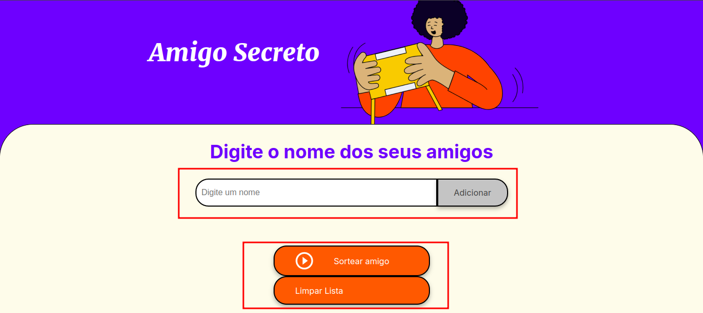
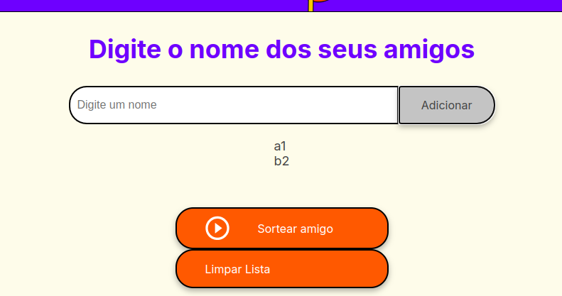
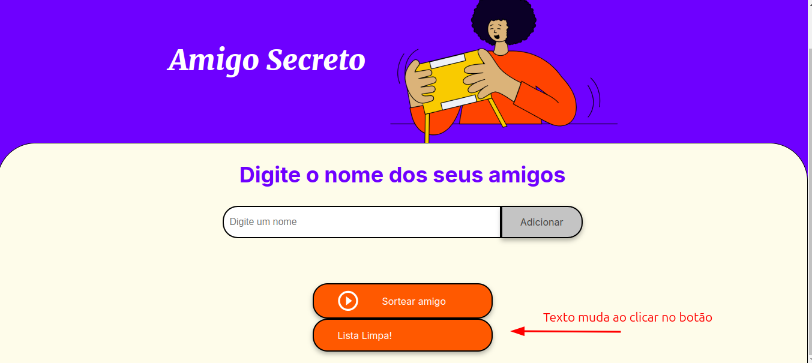

# Amigo Secreto

Este é um projeto simples de uma aplicação web para realizar sorteios de "Amigo Secreto". A aplicação permite que os usuários insiram os nomes dos participantes, visualizem a lista de amigos cadastrados, realizem o sorteio e limpem a lista para um novo sorteio.

## Funcionalidades

- **Adicionar Amigos**: Insira os nomes dos participantes na lista.
- **Visualizar Lista**: Veja todos os nomes que foram adicionados.
- **Sortear Amigo**: Realize o sorteio de um amigo secreto.
- **Limpar Lista**: Remova todos os nomes da lista para começar um novo sorteio.

## Como Usar

1. **Adicionar Amigos**:
   - Digite o nome de um amigo no campo de texto.
   - Clique no botão "Adicionar" para incluir o nome na lista.
    

2. **Visualizar Lista**:
   - Os nomes adicionados serão exibidos em uma lista abaixo do campo de texto.
    

3. **Sortear Amigo**:
   - Clique no botão "Sortear amigo" para realizar o sorteio.
   - O nome do amigo sorteado será exibido na tela.

4. **Limpar Lista**:
   - Clique no botão "Limpar Lista" para remover todos os nomes e começar um novo sorteio.
    

## Estrutura do Projeto

- **index.html**: Contém a estrutura HTML da aplicação.
- **style.css**: Contém os estilos CSS para a aplicação.
- **app.js**: Contém a lógica JavaScript para adicionar, sortear e limpar os nomes dos amigos.

## Pré-requisitos

- Navegador web moderno (Google Chrome, Mozilla Firefox, Safari, etc.).

## Como Executar

1. Clone este repositório ou faça o download dos arquivos.
2. Abra o arquivo `index.html` no seu navegador.

## Personalização

- **Estilos**: Você pode personalizar os estilos da aplicação editando o arquivo `style.css`.
- **Funcionalidades**: Adicione novas funcionalidades ou melhore as existentes editando o arquivo `app.js`.

## Contribuição

Contribuições são bem-vindas! Sinta-se à vontade para abrir issues e pull requests.

## Licença

Este projeto está licenciado sob a [MIT License](LICENSE).

---

**Divirta-se organizando seu Amigo Secreto!** 🎉
